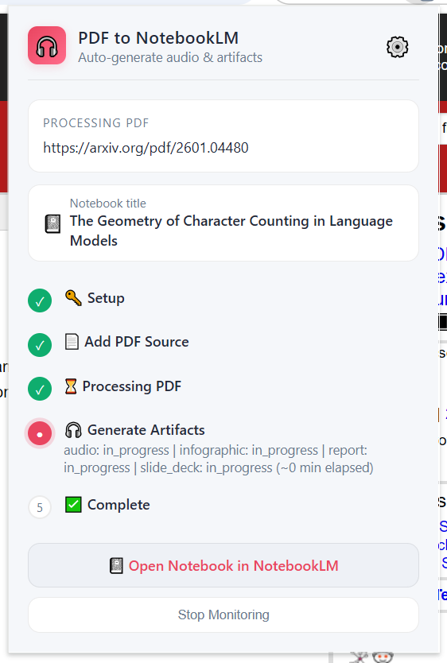
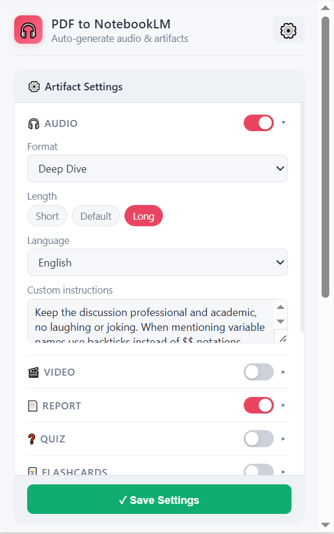

# Chrome PDF to NotebookLM

Chrome extension to detect PDF/web sources and create a NotebookLM notebook with artifacts (audio, infographic, and more).

## Screenshots

## 한국어 가이드

### 1. 개요
`Chrome PDF to NotebookLM`은 현재 탭에서 PDF를 찾거나 URL/로컬 파일을 받아 NotebookLM으로 전송하고, 아티팩트 생성을 자동화하는 확장 프로그램입니다.

### 2. 설치 (개발자 모드)
1. 이 저장소를 로컬에 클론/다운로드합니다.
2. Chrome에서 `chrome://extensions`를 엽니다.
3. 우측 상단 `개발자 모드`를 켭니다.
4. `압축해제된 확장 프로그램을 로드`를 클릭합니다.
5. 이 폴더(`chrome-extension`)를 선택합니다.
6. 확장 목록에 `Chrome PDF to NotebookLM`이 표시되면 설치 완료입니다.

### 3. 활성화 및 권한
1. 툴바에서 확장 아이콘을 고정(pin)합니다.
2. 로컬 `file://` PDF를 직접 읽어야 한다면 확장 상세 화면에서 `파일 URL에 대한 액세스 허용`을 켭니다.
3. Google 계정으로 NotebookLM(`https://notebooklm.google.com`)에 로그인되어 있어야 합니다.

### 4. 사용 방법

#### A) 웹 PDF / arXiv
1. PDF URL 또는 arXiv 페이지를 엽니다.
2. 확장 아이콘 클릭 후 `Generate Audio Overview`를 누릅니다.
3. 진행 상태를 확인하고 완료 후 `Open Notebook in NotebookLM`으로 이동합니다.

#### B) PDF가 없는 일반 웹페이지
1. 일반 웹페이지에서 확장을 엽니다.
2. `Use Current Webpage URL`을 선택합니다.
3. 페이지 URL이 NotebookLM 소스로 추가됩니다.

#### C) 로컬 PDF
1. 확장을 열고 `Upload Local PDF` 또는 `Use Current PDF and Generate`를 선택합니다.
2. 필요 시 파일 접근 권한을 켭니다.
3. 업로드 후 동일한 파이프라인으로 처리됩니다.

### 5. GitHub 공개 전 개인정보/보안 점검 결과
- 코드에 하드코딩된 API 키, 비밀번호, 개인 토큰은 발견되지 않았습니다.
- 인증은 브라우저의 기존 Google 세션 쿠키를 사용하며, 별도 외부 서버를 두지 않습니다.
- 주 통신 대상은 NotebookLM과 사용자가 선택한 원본 URL입니다.
- 저장되는 상태 데이터는 `chrome.storage.local`의 파이프라인/설정 정보입니다.
- 프라이버시 강화를 위해 `manifest.json`에서 상시 `content_scripts` 주입을 제거했고, 팝업 실행 시점에만 스크립트를 주입하도록 정리했습니다.

### 6. 공개 전 체크리스트
1. 스크린샷에 개인 식별 정보(이름, 문서 제목, URL 쿼리 등)가 없는지 다시 확인하세요.
2. 실제 배포 전에는 권한 범위(`host_permissions`)를 최소화할 수 있는지 검토하세요.
3. NotebookLM 내부 API 변경 시 동작이 깨질 수 있으므로 버전 노트를 남기세요.

---

## English Guide

### 1. Overview
`Chrome PDF to NotebookLM` detects PDF/web sources from your current tab, sends them to NotebookLM, and automates artifact generation.

### 2. Install (Developer Mode)
1. Clone or download this repository.
2. Open `chrome://extensions` in Chrome.
3. Enable `Developer mode`.
4. Click `Load unpacked`.
5. Select this folder (`chrome-extension`).
6. Confirm `Chrome PDF to NotebookLM` appears in your extension list.

### 3. Activate and Permissions
1. Pin the extension in your Chrome toolbar.
2. If you need direct `file://` PDF reading, enable `Allow access to file URLs` in extension details.
3. Sign in to NotebookLM (`https://notebooklm.google.com`) with your Google account.

### 4. How to Use

#### A) Web PDF / arXiv
1. Open a PDF URL or an arXiv page.
2. Click the extension icon and press `Generate Audio Overview`.
3. Track progress and open the result via `Open Notebook in NotebookLM`.

#### B) Webpage URL (No PDF detected)
1. Open a regular webpage.
2. Launch the extension.
3. Click `Use Current Webpage URL` to add it as a NotebookLM source.

#### C) Local PDF
1. Open the extension and choose `Upload Local PDF` or `Use Current PDF and Generate`.
2. Enable file URL access if needed.
3. Upload and run the same pipeline.

### 5. Privacy/Security Check Summary
- No hardcoded API keys, passwords, or personal access tokens were found.
- Auth relies on your existing Google browser session.
- Network calls go to NotebookLM and user-selected source URLs.
- Runtime state/settings are stored in `chrome.storage.local`.
- To reduce passive page access, always-on `content_scripts` were removed from `manifest.json`; detection script injection now happens on demand from the popup.

## Credits
- This project's NotebookLM RPC communication was heavily informed by [`teng-lin/notebooklm-py`](https://github.com/teng-lin/notebooklm-py).

## License
MIT. See [LICENSE](./LICENSE).

